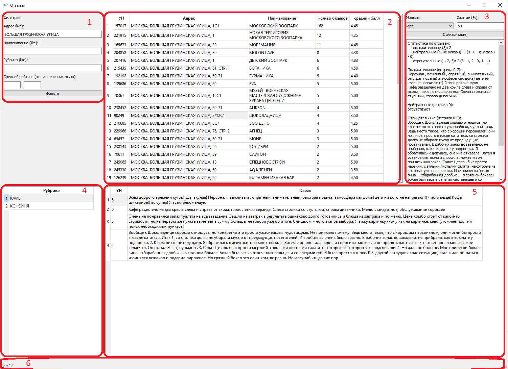

Проект команды № 10

Участники:
- Дмитрий Кудлай - не участвует;
- Максим Ластин - аналитик, ML-инженер;
- Эрфан Абкадыров - не участвует;
- Александр Попов - проектирование, разработка кода (база данных, интерфейс, код на сервере), ML-инженерия.

Цель проекта – предоставить пользователю возможность получить сжатый отзыв по объекту (чтобы не читать все).

Пример работоспособен, скрипт запущен на облачном сервере и обрабатывает запросы в период работы в рамках хакатона. Для  проверки работоспособности достаточно запустить файл в папке interface\ interface.py.

Файлы размещены по каталогам:
database – файл для создания объектов в базе (таблицы, функции)
interface – интерфейс приложения для ПК
load_to_base – скрипт для загрузки данных в базу из файла geo-reviews-dataset-2023.tskv
server – скрипт, запущенный на сервере – суммаризация текста

Описание последовательности действий:
1. Посредством скрипта load_to_base.py файлы загружаются в таблицу stage_object_otziv. На этом этапе предобработка сводится к разделению данных по полям (address, name_ru, rating, rubrics,text). В завершение скрипта запускается public.stage_object_otziv_perv_obr()
2. public.stage_object_otziv_perv_obr() – обеспечивает предварительную обработку и нормализацию данных:
- предварительная обработка сводится к тому, чтобы оставить в тексте только символы, имеющие значение для анализа (табуляторы, двойные пробелы, знаки восклицания, удаление эмодзи и т.д.).
- дополнительно, значения в полях address, name_ru переводятся в верхний регистр (чтобы исключить разницу в написании).
- данные нормируются и раскладываются по таблицам (object_main, otziv, rubrics, spr_rubrics)
3. Пользователь работает с Интерфейсом программы:
 

Пользователь может установить один и (или) несколько фильтров:
- адрес (поиск по условию like)
- наименование (поиск по условию like)
- рубрика (поиск по условию like)
- средний рейтинг  (максимальное и/или минимальное значение)
Интерфейс разделён на 6 зон:
Участок 1 пользователь устанавливает один и (или) несколько  фильтров для отбора объектов;
Участок 2 отображается список объектов;
участок 3 – область суммаризации;
участок 4 – категории выбранного объекта;
участок 5 – комментарии пользователей по объекту.

Параметры суммаризации:
- три модели (на выбор):
   -'gpt' - 'sberbank-ai/rugpt3small_based_on_gpt2'
   - 'bert' - 'bert-base-multilingual-cased'
   - 'rubert' - 'DeepPavlov/rubert-base-cased'
- % сжатия итогового текста.

При нажатии на кнопку «Суммаризация» заявка на выполнение суммаризации (входные параметры для работы модели) заносятся в таблицы «zayavka_main_summarise», «zayavka_main_summarise_detal», после чего интерфейс ожидает выполнения заявки (ежесекундно «опрашивая» таблицу «zayavka_main_summarise», куда заносится отметка о выполнении и получает результат из таблицы zayavka_main_summarise_result).

Скрипт на сервере на постоянной основе ежесекундно опрашивает таблицу «zayavka_main_summarise» на предмет появления новых заявок, выполняет суммаризацию по параметрам, результат заносится в таблицу «zayavka_main_summarise_result» о выполнении заявки проставляет отметку в таблице «zayavka_main_summarise».

Благодаря использованию базы данных проект доступен в многопользовательском режиме, а серверная часть может быть размещена на нескольких серверах (при этом у каждого сервера будут свои задачи).
